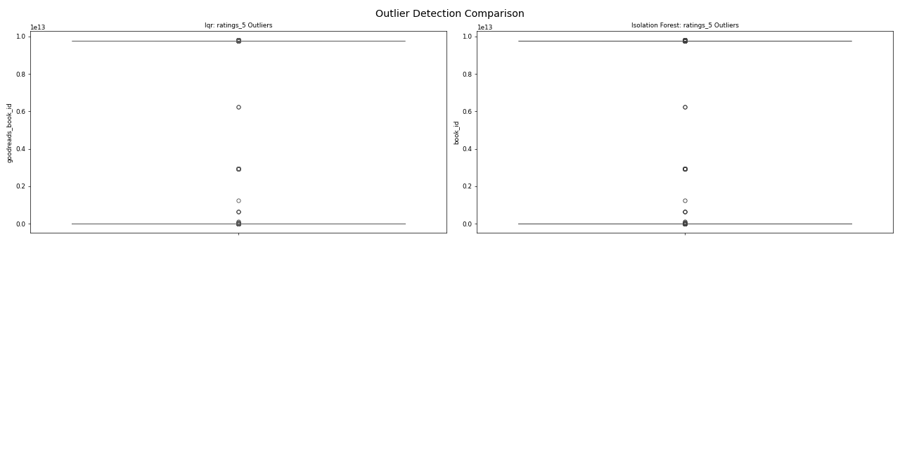
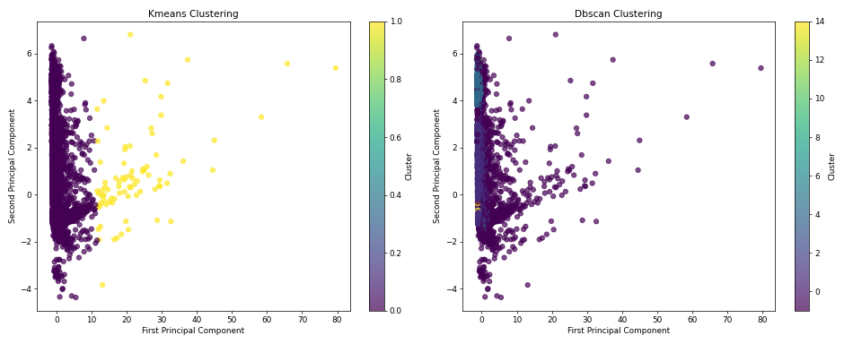
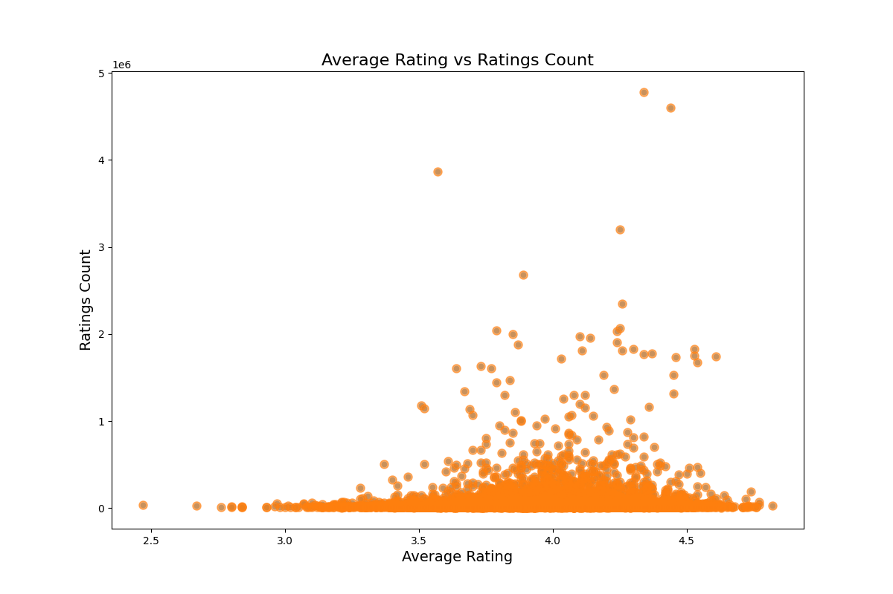

# Data Analysis Report

    ### Narrative: Unveiling the Insights of the Goodreads Book Dataset

#### Dataset Overview

In the realm of literature, understanding reader preferences and trends is crucial for publishers, authors, and marketers alike. Our exploration begins with a rich dataset sourced from the Goodreads platform, comprising **10,000 rows and 23 columns** that encapsulate various attributes of books. Each column serves as a window into the intricacies of the literary world, offering insights into book characteristics, reader engagement, and authorship.

The dataset includes unique identifiers such as `book_id`, `goodreads_book_id`, and `work_id`, which are essential for distinguishing individual entries and facilitating data manipulation. Attributes like `authors`, `original_publication_year`, and `average_rating` provide context and metrics for evaluating literary quality and popularity. The presence of `ratings_count` and `work_text_reviews_count` indicates reader engagement, while the `isbn` and `isbn13` columns ensure cross-referencing capabilities with other databases or platforms.

However, the dataset is not without its challenges; potential data quality issues, such as duplicates or missing values, could impact the accuracy of our analyses. The richness of the dataset is further highlighted by its capacity for multifaceted analysis, making it an invaluable resource for understanding the dynamics of book readership.

#### Statistical Insights and Analysis

Delving deeper into the dataset, we performed a comprehensive statistical analysis, uncovering significant patterns and behaviors among readers and books. A **feature importance analysis** revealed that while most features hold similar significance, the distribution of ratings (`ratings_1` to `ratings_5`) stands out. This indicates that understanding the nuances of user satisfaction and the specific ratings can provide substantial insights into reader preferences.

Our **normality tests** found all features to be non-normally distributed, emphasizing the need for careful statistical methods. This non-normality implies that conventional statistical tests may not yield reliable results without appropriate transformations, such as log or Box-Cox transformations.

Outlier analysis highlighted a substantial presence of outliers, particularly in `books_count`, `ratings_count`, and `work_text_reviews_count`. This suggests that certain books or authors significantly deviate from the norms, warranting further investigation into their unique characteristics.

Clustering the dataset revealed two distinct groups of books, shedding light on user behaviors and book characteristics. The first cluster likely represents popular titles with high engagement, while the second may include lesser-known works, suggesting different marketing strategies for each segment.

#### Unexpected Patterns and Correlations

As we navigated through the landscape of the dataset, several unexpected patterns emerged. The high percentage of outliers in ratings indicated polarized opinions among readers. This phenomenon signifies that some books are either highly adored or strongly disliked, reflecting deep-seated reader sentiments.

Interestingly, a potential correlation between the number of books an author has published and their ratings suggests that prolific authors may produce works of varying quality. This insight could guide marketing efforts, focusing on promoting the best-rated works while considering the author's overall portfolio.

#### Strategic Recommendations

In light of our findings, a series of strategic recommendations can be proposed:

1. **Data Preprocessing**: Begin with data cleaning to remove duplicates and standardize author names. Address missing values judiciously, utilizing imputation methods where necessary.

2. **Outlier Management**: Investigate the nature of outliers and consider using capping techniques or transformations to mitigate their influence. Alternatively, isolate outliers for specialized analysis to uncover unique trends.

3. **Cluster Analysis**: Further investigate the two identified clusters to discern the characteristics that set them apart. This could inform targeted marketing strategies tailored to each segment.

4. **Correlation Studies**: Conduct in-depth correlation assessments to explore relationships between ratings and reader engagement metrics. Understanding these dynamics could enhance promotional strategies.

5. **Predictive Modeling**: Implement machine learning techniques, such as regression models to predict average ratings based on other features or recommendation systems that leverage user ratings and preferences.

6. **Business Implications**: Use clustering insights to refine marketing strategies, prioritize inventory based on anticipated popularity, and foster community engagement around well-reviewed books.

#### Conclusion

The analysis of the Goodreads dataset illuminates the intricate tapestry of reader preferences and book dynamics. By leveraging the diverse attributes and insights gleaned from our statistical exploration, stakeholders can make informed decisions to enhance reader engagement, optimize marketing efforts, and ultimately elevate the literary experience.

The use of LLM-generated code facilitated the creation of a scatter plot, showcasing the relationship between average ratings and ratings count. This visual representation serves as a vital tool for understanding reader engagement and can guide further analysis or strategic decisions.

In summation, this dataset offers a plethora of opportunities for deeper exploration and analysis, and the insights derived can significantly impact how books are marketed and promoted in an increasingly competitive literary landscape.

    

## Visualizations

