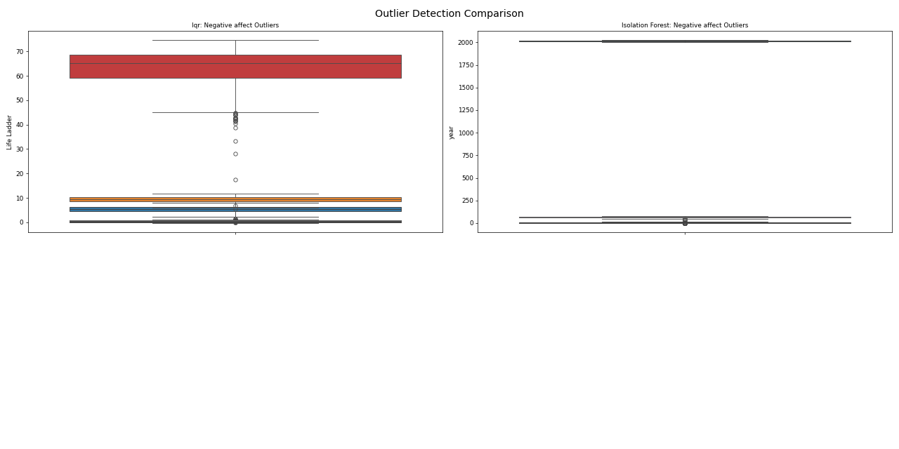
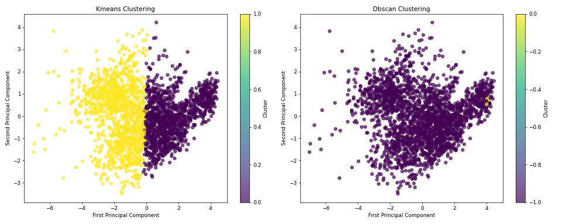
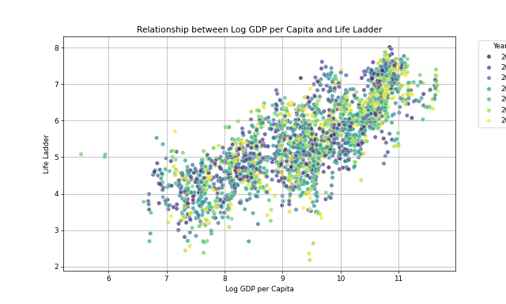

# Data Analysis Report

    ### Understanding Well-Being Through Data: A Comprehensive Narrative

In a world increasingly defined by data, understanding the nuances of well-being across different countries is paramount. With a dataset comprising 2363 observations across 11 diverse attributes, we embark on a journey to uncover insights that connect life satisfaction with socio-economic factors and emotional well-being.

#### Comprehensive Overview of the Dataset

At the core of our analysis lies a rich dataset structured to capture various dimensions of well-being. The dataset encompasses details from multiple countries and years, allowing for both cross-sectional and longitudinal analyses. The attributes include essential indicators such as the "Life Ladder," which measures subjective well-being, alongside economic indicators like "Log GDP per capita," social support metrics, and assessments of personal freedom, health outcomes, generosity, and perceptions of corruption.

The diversity of the data is one of its most compelling characteristics. With such a wide array of measurements, we can explore complex relationships between economic prosperity and life satisfaction while considering emotional and social factors. However, we must also acknowledge potential data quality issues, such as missing values and inconsistencies in reporting, which require careful attention to ensure valid conclusions.

#### Statistical Insights and Patterns Analysis

Diving into the statistical realm, our analysis reveals the importance of certain features in predicting life satisfaction. Both the "year" and "Life Ladder" are crucial predictors, suggesting that as socio-economic conditions evolve, so too does life satisfaction. Notably, normality tests indicate that the features significantly deviate from a normal distribution, hinting at the need for transformations to better fit parametric assumptions.

Outlier detection further enriches our understanding. While most variables exhibit only a few anomalies, "Perceptions of Corruption" stands out with the highest outlier count, potentially indicating polarized views on governance across regions. The clustering analysis reveals two distinct groups: one characterized by high life satisfaction and robust socio-economic metrics, while the other represents lower satisfaction levels, likely tied to economic and social deficits.

Unexpected patterns emerge as well, such as the potential negative correlation between "Perceptions of Corruption" and "Life Ladder." This relationship underscores the importance of governance quality in shaping life satisfaction. Moreover, the significant outlier presence in "Social Support" suggests that community dynamics may play a pivotal role in enhancing well-being.

#### Strategic Recommendations

Building upon our findings, we outline strategic recommendations to enhance the utility of the dataset and the insights gleaned from it. 

1. **Data Preprocessing**: Prioritize normalization and standardization of features to accommodate the different scales present in the dataset. Techniques like handling missing values and encoding categorical variables will also be crucial for robust analysis.

2. **Outlier Management**: Investigate outliers to determine their nature, and consider applying transformations or capping extreme values to mitigate their influence on analysis. Employing robust statistical techniques can further enhance the reliability of our findings.

3. **Further Investigation**: Delve deeper into cluster characteristics and temporal trends to capture how well-being evolves over time. Correlation analysis can reveal critical drivers of life satisfaction, while subgroup analysis can illuminate differences across regions or income levels.

4. **Machine Learning Approaches**: Consider employing clustering algorithms and predictive modeling techniques to uncover more nuanced insights. Dimensionality reduction methods can also aid in visualizing complex relationships within the data.

5. **Implications for Policy and Research**: Our insights can inform policymakers and researchers about the socio-economic factors driving life satisfaction, enabling targeted interventions in regions facing challenges. Understanding the characteristics of each cluster can assist in resource allocation and strategic planning.

To complement our analytical journey, a visualization was created to illustrate the relationship between "Log GDP per capita" and the "Life Ladder." This scatter plot highlights the correlation between economic prosperity and life satisfaction, with data points colored by year to indicate temporal trends.

### Conclusion

Through meticulous analysis and strategic recommendations, we have crafted a narrative that not only elucidates the complexities of well-being across different nations but also provides actionable insights for stakeholders. By leveraging the rich dataset at our disposal, we can foster a deeper understanding of what drives life satisfaction and, ultimately, contribute to enhancing the quality of life for individuals around the globe.

    

## Visualizations

