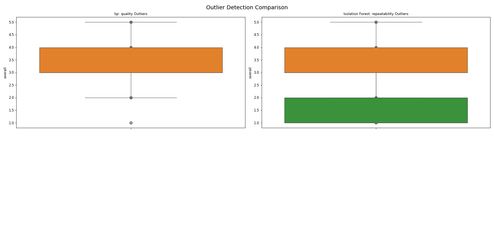
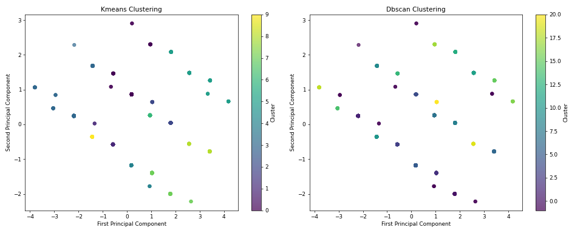
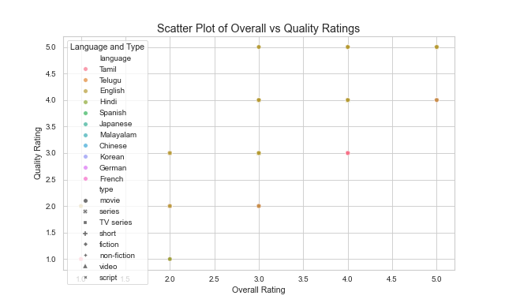

# Data Analysis Report

    ### Comprehensive Narrative on the Dataset Analysis

In the realm of data analysis, the first step toward unlocking valuable insights is understanding the dataset at hand. Our dataset, comprising 2,652 rows and 8 columns, encapsulates a rich tapestry of user-generated content or feedback, capturing various attributes essential for thorough analysis. 

#### Dataset Overview

The dataset's structure is designed to facilitate diverse analyses. Each column represents a unique dimension of the data, ranging from timestamps and languages to user ratings and content types. The **date** column serves as a temporal anchor, allowing us to track trends and changes over time. However, the text format indicates potential inconsistencies that could complicate temporal analyses. The **language** and **type** columns are equally significant, revealing insights into the demographic and thematic diversity of the content. 

The **overall**, **quality**, and **repeatability** columns introduce a quantitative aspect, enabling us to assess user satisfaction and content reliability. Yet, the presence of categorical numeric columns raises the need for careful interpretation, as they may not fully encapsulate nuanced opinions. Potential data quality issues, such as inconsistent formats and missing values, necessitate diligent preprocessing to ensure the integrity of our analyses.

#### Statistical Insights

Diving deeper, our statistical exploration reveals a number of intriguing patterns. The **Feature Importance** analysis, while not detailed, signals the necessity to identify which variables most significantly influence outcomes, guiding our data preprocessing and feature selection efforts. 

Normality tests indicate that some columns may not follow a normal distribution, suggesting a need for transformations to meet the assumptions of parametric analyses. The **Outlier Analysis** reveals a striking prevalence of outliers, particularly within the overall ratings, with about 45.85% of entries flagged as outliers using the IQR method. This raises critical questions about data reliability and highlights the need for a strategic approach to manage these anomalies.

In contrast, the clustering analysis identifies 10 optimal clusters within the dataset, indicating distinct segments that can guide targeted interventions. Understanding these clusters will not only reveal hidden structures but also inform strategies across different user demographics and content types.

#### Strategic Recommendations

With these insights in hand, we can formulate strategic recommendations to enhance data quality and extract actionable insights. 

1. **Data Preprocessing**: Implement robust data cleaning techniques to address missing values, ensure proper data types, and standardize categorical variables. This foundational step will set the stage for more accurate analyses.

2. **Outlier Management**: A thorough investigation into the context of outliers will help determine their nature—whether they represent valid extremes or data entry errors. Depending on their classification, we may apply techniques such as capping, transformation, or removal to mitigate their impact on our analyses.

3. **Further Investigative Insights**: Delving into cluster characteristics, exploring correlations among ratings, and analyzing temporal trends will enrich our understanding of the dataset. These insights can lead to targeted strategies in marketing, product development, and quality control.

4. **Machine Learning Approaches**: Employ clustering algorithms and predictive modeling techniques to refine our understanding and leverage the data for forecasting and classification tasks.

5. **Business Implications**: Utilizing these insights can inform personalized engagement strategies, quality improvement efforts, and effective resource allocation, ultimately leading to enhanced decision-making processes.

#### Visual Representation

To convey these insights visually, we have generated a scatter plot that analyzes the relationship between **overall ratings** and **quality ratings**, with distinctions made based on **language** and **type** of content. This visualization serves to elucidate potential correlations, allowing stakeholders to grasp complex relationships at a glance.

The code employed for this visualization enhances our ability to load the dataset with various encoding options, ensuring comprehensive accessibility of the data. Utilizing Seaborn, the scatter plot is designed to effectively represent the interplay between ratings, thus offering a clear, engaging, and informative visual summary of our findings.

### Conclusion

In conclusion, this narrative illustrates the intricate layers of our dataset, revealing both challenges and opportunities for insightful analysis. By addressing data quality issues, understanding statistical relationships, and strategically applying our findings, we can unlock the full potential of this dataset. The journey of transforming raw data into actionable insights is not just an analytical endeavor but a pathway toward informed decision-making and strategic growth.

    

## Visualizations

